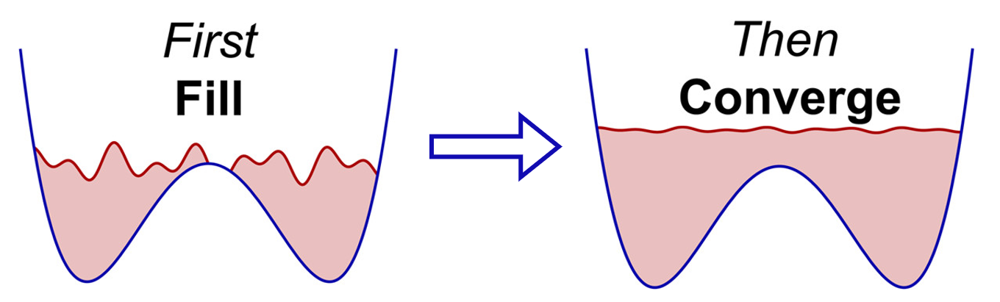
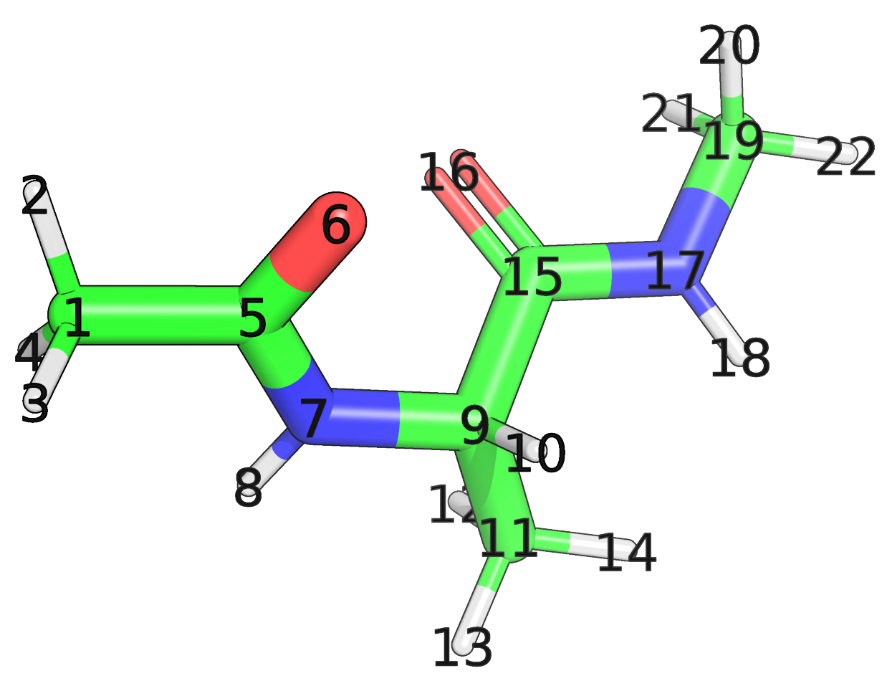
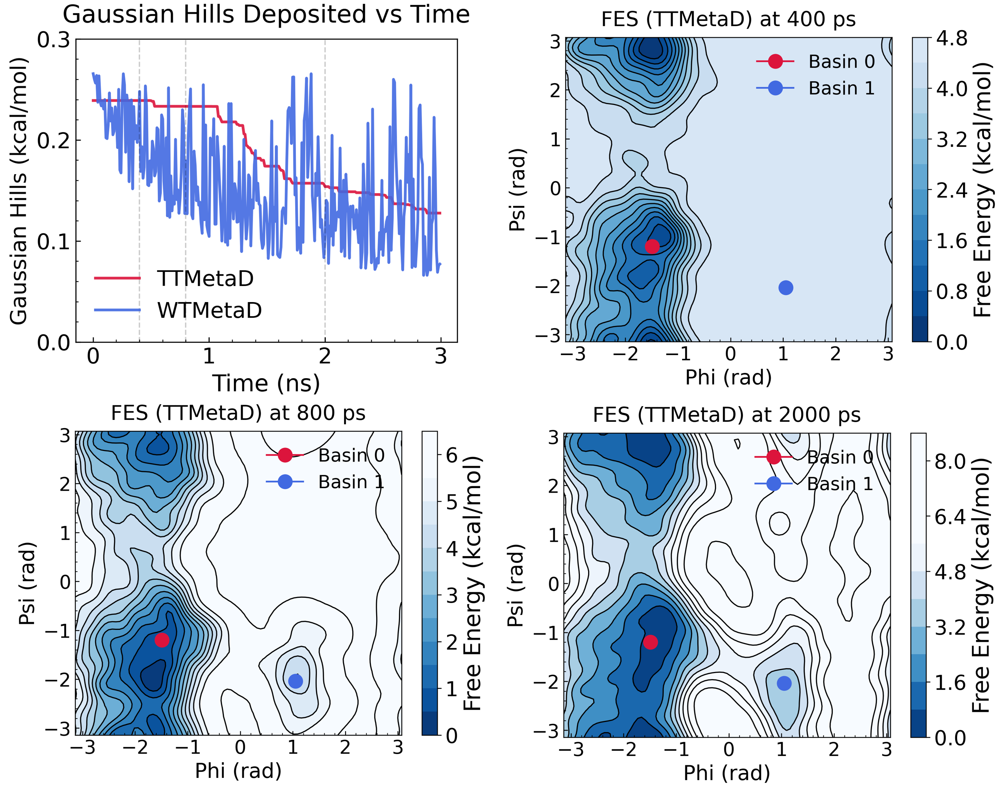
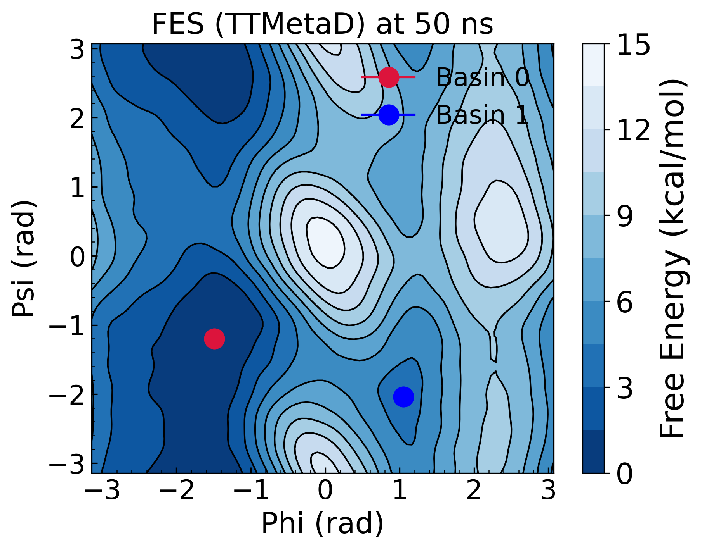
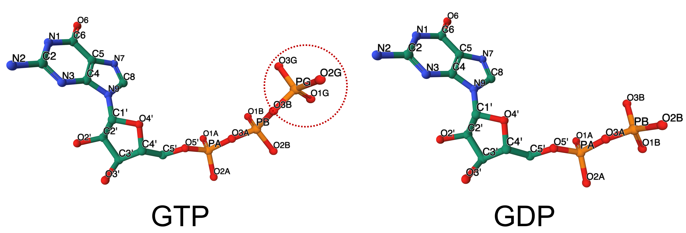
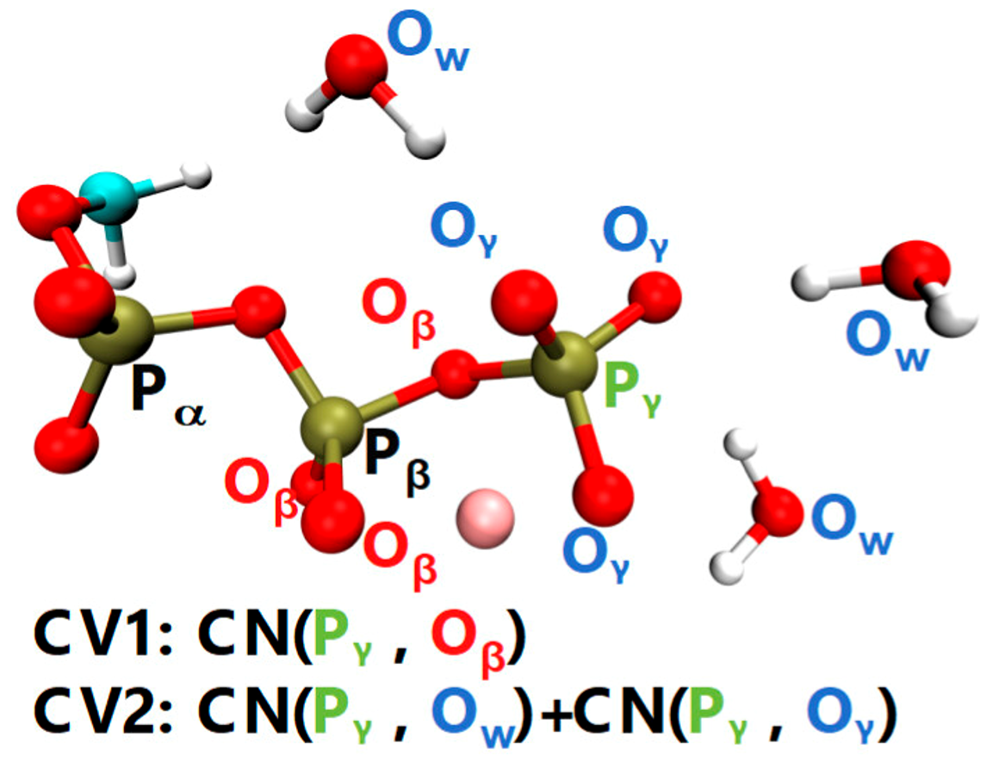
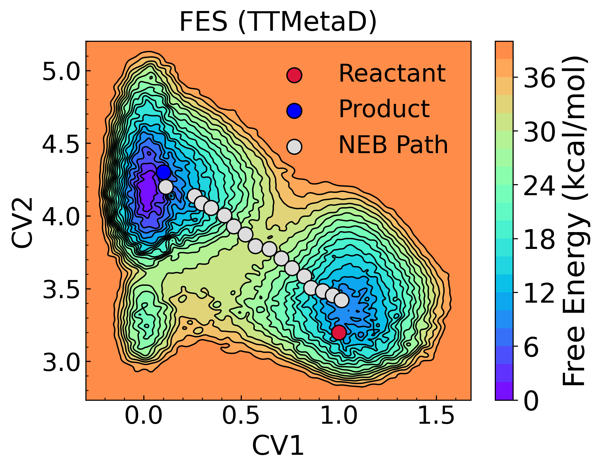

# PLUMED Masterclass: Transition-Tempered Metadynamics

## Origin 

This masterclass was authored by Jiangbo Wu and Gregory A. Voth on September 10, 2024

## Aims

This tutorial aims to guide users on how to determine the potential of mean force (PMF) of a select number of collective variables (CVs) using transition-tempered metadynamics (TTMetaD) simulations, which is an improved, smoothly convergent variant of metadynamics (MetaD) that enhances the convergence and efficiency of free energy calculations.

## Objectives

By the end of this tutorial, you will know the skills to:

- Perform TTMetaD simulations and optimize its parameters using Alanine Dipeptide as a model system.
- Elucidate the catalytic mechanism of GTP hydrolysis in microtubules by determining the PMF using QM/MM TTMetaD simulations.

## Prerequisites

**MetaD Experience**: While prior experience with MetaD and PMF calculations is preferred, it is not strictly required. This tutorial begins with a TTMetaD simulation of the backbone dihedral angles of an alanine dipeptide in vacuum, and its implementation closely resembles the standard MetaD simulations but with slight parameter differences.

**CP2K and QM/MM Experience**: For the second example, familiarity with CP2K and QM/MM simulations is recommended. Additionally, some proficiency with Python (Jupyter Notebook) will be helpful for data analysis and visualization.

## Overview
Well-tempered metadynamics (WTMetaD) is widely recognized as an effective adaptive enhanced sampling method for investigating biomolecular and materials systems. However, selecting the appropriate tunable parameters can be challenging, especially when investigating complex and computationally expensive systems, such as enzymatic reactions using QM/MM simulations. Achieving a balance between rapid escape from local metastable states and fast convergence of the overall free energy estimate often presents a significant challenge. To address these challenges, [Dama et al.](https://pubs.acs.org/doi/full/10.1021/ct500441q) developed transition-tempered metadynamics (TTMetaD). As illustrated in the figure below, TTMetaD is designed to minimize overall runtime by ensuring that the hills remain untempered during the initial phase—thus shortening this phase—while still being properly tempered in the second phase to secure the asymptotic convergence of the free energy surface.



This method maintains the smooth convergence characteristic of WTMetaD but eliminates the need for prior knowledge of barrier heights, therefore avoiding the trade-off between rapid barrier crossings and fast convergence. Instead, TTMetaD requires an estimate of free energy basin positions and adjusts the height of added hills based on the number of round trips between these basins. Basins can be selected based on experimental data, physical and chemical insights, or intuition, with a focus on the specific goals of the metadynamics study. The method is particularly well-suited for studying state-to-state transitions where the key states are known, but the transition mechanisms remain elusive. This is especially valuable for investigating computationally expensive systems like the second example in this tutorial, where even modest improvements in simulation efficiency can lead to significant savings in computational resources and wall time. It is also important to note that TTMetaD remains effective as long as the basin-defining coordinate lies within a reasonable isosurface of free energy around the true basin minimum—approximately half the barrier-basin free energy difference. This flexibility makes TTMetaD a permissive and robust method suitable for a wide range of applications.

## Software and data

This tutorial includes two exercise sections. In Section 1, a PLUMED-patched GROMACS is sufficient, while Section 2 requires a PLUMED-patched CP2K. Due to the high computational cost of running QM/MM simulations, here you may use the pre-generated HILLS data available on the [GitHub](https://github.com/uchicago-voth/masterclass-24-09-ttmetad) page and do the analysis. The structure files and complete PLUMED input files can also be found there. However, we strongly recommend that users attempt to write the PLUMED input files themselves before referring to the solutions provided.

## Exercises

### Section 1: Set up 2D TTMetaD simulations for analine dipeptide

To begin with a relatively straightforward exercise, we will use alanine dipeptide in water as a test system. This example demonstrates how to set up TTMetaD simulations and highlights the differences between TTMetaD and WTMetaD.

Click on the labels of the actions for more information on what each action computes.



#### Step 1: Define the two CVs
First, define the two CVs, the phi and psi angles of alanine dipeptide. 

#### Step 2: Add MetaD bias to the two CVs
Next, add a metadynamics bias to the two CVs by invoking the TTMetaD command. According to the 2D PMF from [Chen et al.](https://doi.org/10.1063/1.4733389), we define two metabasins for the phi and psi angles of alanine dipeptide as (-1.49,-1.20) and (1.05,-2.04), respectively.

```plumed
#SOLUTIONFILE=alad/plumed.dat
MOLINFO STRUCTURE=step3_input.pdb

WHOLEMOLECULES ENTITY0=__FILL__

phi: TORSION ATOMS=__FILL__
psi: TORSION ATOMS=__FILL__

metad: METAD ...
  ARG=__FILL__ PACE=500 HEIGHT=1.0 SIGMA=0.2,0.2 FILE=HILLS
  TTBIASFACTOR=10 TTBIASTHRESHOLD=1
  TRANSITIONWELL0=__FILL__
  TRANSITIONWELL1=__FILL__
  GRID_MIN=-pi,-pi GRID_MAX=pi,pi TEMP=300
...

PRINT ARG=phi,psi,metad.bias STRIDE=10 FILE=COLVAR
```

#### Step 3: Perform TTMetaD simulation
Run the TTMetaD simulation using GROMACS and obtain the data files—specifically, COLVAR and HILLS. For comparison, a similar WTMetaD simulation was performed using the same configuration but without defining transition wells.

#### Step 4: Analyze Gaussian hill depositions
Let’s explore how TTMetaD and WTMetaD deposit Gaussian hills differently. You can extract the Gaussian hills from the HILLS file for both TTMetaD and WTMetaD and visualize the different 2D PMFs at various time points. The results should look like below:



We have provided the data and Python scripts for visualization on the accompanying GitHub page, but we strongly recommend that you try to do this yourself first.

In TTMetaD, the Gaussian hills maintain their initial height until the two defined metabasins begin to partially connect. As the connection between the metabasins strengthens, the deposited Gaussian hills gradually decay to ensure convergence.
In contrast, WTMetaD scales down the Gaussian hills as it revisits previously explored regions.



This example is primarily intended to illustrate the implementation of TTMetaD. A more practical application is covered in the second example.

### Section 2: GTP hydrolysis in microtubules using QM/MM TTMetaD simulations
Microtubules (MTs) are large cytoskeletal polymers composed of αβ-tubulin heterodimers. These dynamic structures can stochastically switch between polymerizing and depolymerizing states. The depolymerization process is closely coupled with the hydrolysis of guanosine triphosphate (GTP) within the β-tubulin subunit, which is bound to the E-site (exchangeable site). In this example, we will set up QM/MM TTMetaD simulations to study the hydrolysis mechanism of GTP at the E-site.




GDP is the hydrolysis product of GTP. The primary structural differences between GTP and GDP involve the coordination configuration of P$_γ$ atom (named PG in the figure above). Before hydrolysis, P$_γ$ is bonded to three O$_γ$ atoms, one O$_β$ atom (named PB in the figure above), and partially connected to the solvent water oxytens (named OW). After hydrolysis, but before the release of Pi from the binding pocket, P$_γ$ is connected to three O$_γ$ atoms (O1G, O2G, and O3G in the figure above) and one water oxygen.

We define two CVs to characterize GTP hydrolysis reaction:
- Dissociation of phosphate: Captured by the coordination number between P$_γ$ and O$_β$. This CV varies from approximately 1 in the reactant state to 0 in the product state.
- Association of water with P$_γ$: Captured by the coordination numbers of P$_γ$ with O$_\text{w}$ and P$_γ$ with O$_γ$. This CV varies from roughly 3 in the reactant state to over 4 in the product state.



Based on previous studies of ATP hydrolysis in actin by [Sun et al.](https://doi.org/10.1021/acs.jctc.7b00077), we define the reactant basin at (1.0, 3.2) and the product basin at (0.1, 4.3). These basin centers help determine when a trajectory has crossed into the reactant or product well and are the endpoints for the path connecting the two wells. The only input of TTMetaD is the minimum bias on the maximally biased path between the two wells.

#### Step 1: Define the two CVs
Start by defining the two coordination numbers of the Pγ atom.
  
```plumed
# colvar definitions for TTMetaD
P: GROUP ATOMS=13513 # Gamma Phosphorus
Ow: GROUP ATOMS=21459,56067,76824,83058,91299,99828,102303,102732,102738,108342,129147,130071,159021,165957,13514,13515,13516 # QM Water Oxygens AND Gamma Oxygens
Ob: GROUP ATOMS=13510,13511,13512 # Beta Oxygens

# NN = 6, ND = 12 
cb: COORDINATION GROUPA=P GROUPB=Ob R_0=2.38
cw: COORDINATION GROUPA=P GROUPB=Ow R_0=2.38

ex: EXTENDED_LAGRANGIAN ARG=cb,cw KAPPA=1300,1300 TAU=31.4,31.4
```

#### Step 2: Add MetaD bias with delayed tempering
Apply a metadynamics bias to the two CVs using TTMetaD, with a delayed tempering condition of V* > 1 kcal/mol.

```plumed
m: METAD ...
   ARG=ex.cb_fict,ex.cw_fict
# 1 kcal/mol height   
   HEIGHT=1 
# SIGMA is in CV space   
   SIGMA=0.020,0.020
# hill addition frequency
   PACE=40
   TEMP=310
   TTBIASFACTOR=5
   TTBIASTHRESHOLD=1
# define two transition wells
   TRANSITIONWELL0=1.0,3.2
   TRANSITIONWELL1=0.1,4.3
... m:
```

### Step 3: Perform TTMetaD QM/MM simulations
Perform the TTMetaD simulation using CP2K software interfaced with PLUMED library and obtain the data files. Since running QM/MM simulations is computationally expensive, we have provided a copy of pre-generated HILLS data on the [GitHub](https://github.com/uchicago-voth/masterclass-24-09-ttmetad/tree/main/mt_gtp) page for analysis.

### Step 4: Plot the 2D PMF
You can extract the Gaussian hills from the HILLS file for TTMetaD and visualize the final 2D PMF. The results should look like below:



We have provided the data and Python scripts in the Jupyter notebook for visualization on the accompanying [GitHub](https://github.com/uchicago-voth/masterclass-24-09-ttmetad/tree/main/mt_gtp) page, but you are encouraged to try this yourself first.

## Questions
How do you interpret the 2D PMF of GTP hydrolysis in microtubules? What are the key features of the PMF that reveal the hydrolysis mechanism? You may refer to the Results and Discussion part in [Beckett and Voth](https://doi.org/10.1073/pnas.2305899120)!

Numerous biomolecular hydrolysis reactions and enzymatic reactions can be studied using TTMetaD with QM/MM simulations. Can you write a PLUMED input script to bias a similar ATP hydrolysis reaction in one subunit of the actin filament?