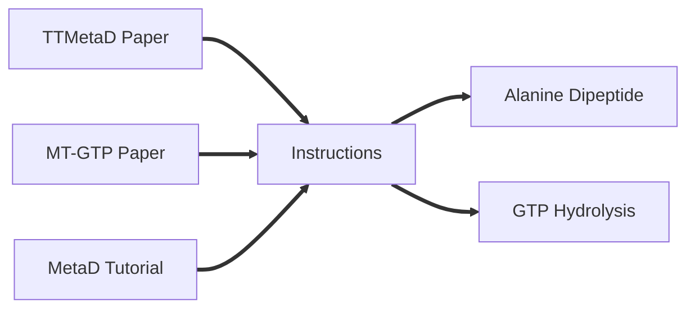

```mermaid
flowchart LR
A[TTMetaD Paper] ==> D[Instructions]
B[MT-GTP Paper] ==> D[Instructions]
C[MetaD Tutorial] ==> D[Instructions]
D[Instructions] ==> E[Alanine Dipeptide]
D[Instructions] ==> F[GTP Hydrolysis]
click A "ref1" "You should read this paper before completing this exercise"
click B "ref2" "You are recommended to read this paper but not required"
click C "ref3" "A previous tutorial that introduces the basics of MetaD"
click D "README.md" "Instructions for the exercise that you are supposed to complete"
click E "alad_plumed.dat" "The complete input file for the Alanine Dipeptide example"
click F "mt_gtp_plumed.dat" "The complete input file for the GTP hydrolysis in microtubules example"
```